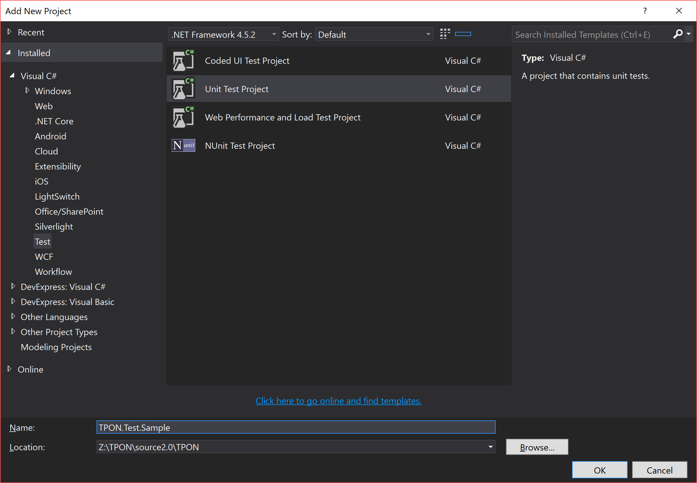
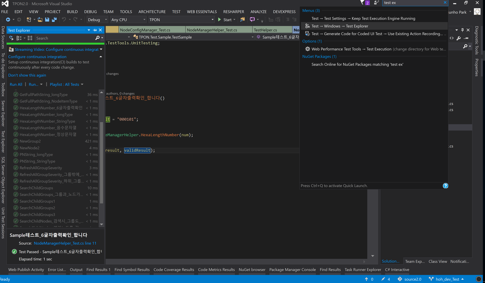
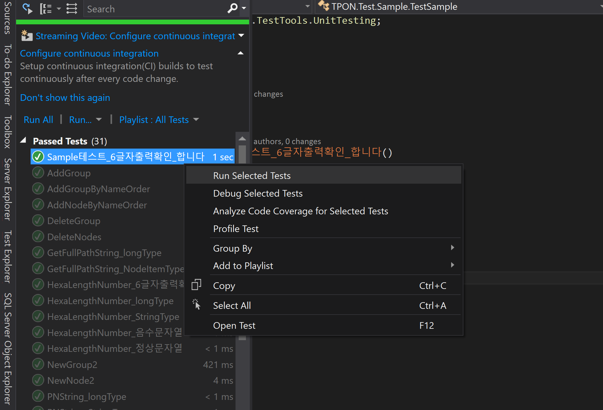
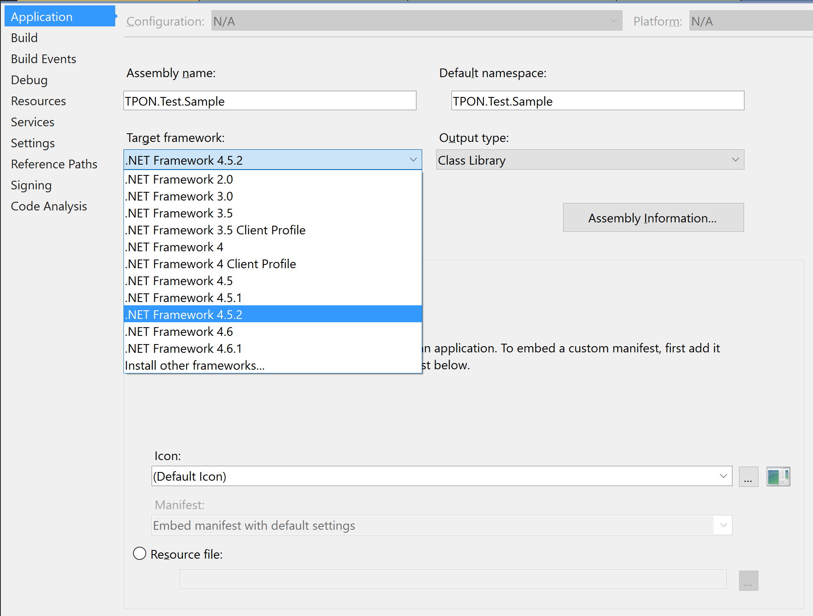

# MSTest Tutorial

## 프로젝트 생성 방법

1. 솔루션에 Test Project를 추가한다.


2. Reference에 테스트하고자 하는 프로젝트를 추가한다.


3. 테스트용 클래스를 만듭니다.
```cs
namespace TPON.Test
{
    [TestClass]
    public class NodeManagerHelper_Test
    {
    }
}
```

4. 테스트를 위한 코드를 추가합니다.
```cs
        [TestMethod]
        public void HexaLengthNumber_6글자출력확인()
        {
            // Arrange
            long num = 101;
            string validResult = "000101";

            // Act
            var result = NodeManagerHelper.HexaLengthNumber(num);

            // Assert
            Assert.AreEqual(result, validResult);
        }
```

5. 현재 코드는 이렇습니다.
```cs
namespace TPON.Test.Sample
{
    [TestClass]
    public class TestSample
    {
        [TestMethod]
        public void HexaLengthNumber_6글자출력확인()
        {
            // Arrange
            long num = 101;
            string validResult = "000101";

            // Act
            var result = NodeManagerHelper.HexaLengthNumber(num);

            // Assert
            Assert.AreEqual(result, validResult);
        }
    }
}
```

6. Test Explorer를 실행합니다.
 - Test -> windows -> Test Explorer 를 실행합니다
 - 혹은 Quick Launch에서 test explorer를 검색합니다.


7. Test를 시작합니다.
 - Run All : 모든 테스트를 시작합니다.
 - 특정 테스트만 실행하려면, 테스트 Item에 우클릭 후 `이 항목을 테스트하기`를 클릭합니다.
 - 디버깅 할 시엔, `이 항목을 디버깅하기`를 클릭합니다.
 - [MSDN 문서 참고](https://msdn.microsoft.com/ko-kr/library/hh212233.aspx)


 - 혹시 아래와 같은 에러 메세지가 뜨시나요?
```
The referenced project 'TPON' is targeting a higher framework version (4.6.1) than this project’s current target framework version (4.5.2). This may lead to build failures if types from assemblies outside this project’s target framework are used by any project in the dependency chain.	TPON.Test.Sample
```
 - 테스트 프로젝트와 타겟 프로젝트의 버전이 맞지 않아 발생하는 에러입니다. 프로젝트 속성에서 .NET framework 버전을 4.6.1로 변경합니다.


#### 다음 문서
##### [테스트 코드 초기화, 정리하기]


##### [Test Method 작성하기]
 